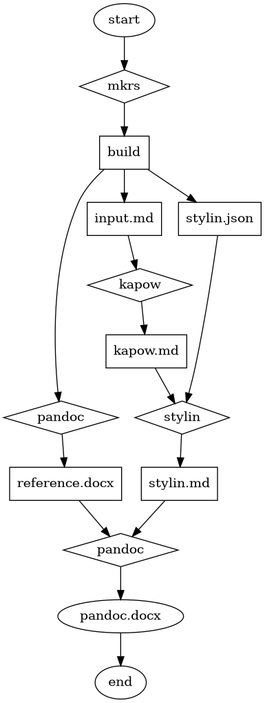

# About

Convert markdown to pandoc markdown with custom styles

Stylin provides a [library](#library) and a [command line utility](#cli).

# Pipeline

Stylin can be used in a pipeline with other tools, like [mkrs], [kapow],
[pandoc], etc.

[mkrs]: https://crates.io/crates/mkrs
[kapow]: https://crates.io/crates/kapow
[pandoc]: https://pandoc.org



# CLI

## Usage

```text
$ stylin -h
Convert markdown to pandoc markdown with custom styles

Usage: stylin [OPTIONS] [PATH]...

Arguments:
  [PATH]...  Input file(s); use `-` for stdin

Options:
  -c <PATH>      Configuration file [default: stylin.json]
  -r             Print readme
  -h, --help     Print help
  -V, --version  Print version
```

```text
$ stylin -V
stylin 0.10.2
```

## Example

Given a configuration file, [`stylin.json`](stylin.json):

~~~json5
{
  // Spans
  code: "Custom Code Style Name",
  emphasis: "Custom Emphasis Style Name",
  strong: "Custom Strong Style Name",
  emphasis_strong: "Custom Emphasis Strong Style Name",
  strong_emphasis: "Custom Strong Emphasis Style Name",
  strong_code: "Custom Strong Code Style Name",

  // Blocks
  heading_1: "Custom Heading Level 1 Style Name",
  heading_2: "Custom Heading Level 2 Style Name",
  heading_3: "Custom Heading Level 3 Style Name",
  heading_4: "Custom Heading Level 4 Style Name",
  heading_5: "Custom Heading Level 5 Style Name",
  heading_6: "Custom Heading Level 6 Style Name",
  paragraph: "Custom Paragraph Style Name",
  ordered_list: "Custom Ordered List Style Name",
  unordered_list: "Custom Unordered List Style Name",
  table: "Custom Table Style Name",
  blockquote: "Custom Blockquote Style Name",
  fenced_code_block: "Custom Fenced Code Block Style Name",
  indented_code_block: "Custom Indented Code Block Style Name",
  figure: "Custom Figure Style Name",
  figure_caption: "Figure Caption Style Name",
  table_caption: "Table Caption Style Name",
  listing_caption: "Listing Caption Style Name",

  // Other
  debug: false,
}
~~~

And an input file, [`input.md`](input.md):

~~~md
# Heading level 1

This is a paragraph.

Here's a paragraph with a `code span`.

Another paragraph with two code spans: `alpha` and `bravo`.

Here's a code span with a backtick: ``code span with ` backtick``.

* Unordered list item 1

  Paragraph

* Unordered list item 2

  * Nested list item

1. Ordered list item 1

   Paragraph

2. Ordered list item 2

   1. Nested list item

## Heading level 2

A | B
---:|:---
1 | 2
2 | 4
3 | 8
4 | 16

### Heading level 3

Paragraph with
*emphasis text 1*,
_emphasis text 2_,
**strong text 1**,
__strong text 2__,
***emphasis strong text 1***,
___emphasis strong text 2___,
_**emphasis strong text 3**_,
*__emphasis strong text 4__*,
**_strong emphasis text 1_**,
__*strong emphasis text 2*__, and
**`strong code text`**.

#### Heading level 4

    1: Indented code block
    2: 
    3: Blah

##### Heading level 5

> Blockquote paragraph
>
> > Nested blockquote paragraph

###### Heading level 6

```info
1: Fenced code block
2: 
3: Blah
```

:::{custom-style="Some Other Custom Style"}
This paragraph already has a block style.
:::

:::{custom-style="Some Other Custom Style"}
* Alpha

* Bravo

* Charlie
:::


[text](https://github.com/qtfkwk/stylin)

[text](https://github.com/qtfkwk/stylin "title")

[](https://github.com/qtfkwk/stylin)

[](https://github.com/qtfkwk/stylin)

[](https://github.com/qtfkwk/stylin)

[](https://github.com/qtfkwk/stylin)

[](https://github.com/qtfkwk/stylin "title")

[](https://github.com/qtfkwk/stylin "title")

[](https://github.com/qtfkwk/stylin "title")

[](https://github.com/qtfkwk/stylin "title")

Alpha [](https://github.com/qtfkwk/stylin "title") bravo.

* Unordered list item

  

1. Ordered list item

   

A | B
---|---
1 | 

> 

A | B
---|---
1 | 2<br>3

This code span has a backslash: `Code span with a \ backslash`.

* [ ] Milk
    * [ ] Fat free
    * [ ] Whole
* [ ] Eggs
* [ ] Bananas

```[ignore]
# Comment
```

Figure: Figure Caption

Table: Table Caption

Listing: Listing Caption

Figure 1.2: Caption for figure 1.2

~~~

Run the stylin command:

```bash
stylin input.md >stylin.md
```

To produce the output file, [`stylin.md`](stylin.md):

~~~text
:::{custom-style="Custom Heading Level 1 Style Name"}
Heading level 1
:::

:::{custom-style="Custom Paragraph Style Name"}
This is a paragraph.
:::

:::{custom-style="Custom Paragraph Style Name"}
Here's a paragraph with a [code span]{custom-style="Custom Code Style Name"}.
:::

:::{custom-style="Custom Paragraph Style Name"}
Another paragraph with two code spans: [alpha]{custom-style="Custom Code Style Name"} and [bravo]{custom-style="Custom Code Style Name"}.
:::

:::{custom-style="Custom Paragraph Style Name"}
Here's a code span with a backtick: [code span with ` backtick]{custom-style="Custom Code Style Name"}.
:::

:::{custom-style="Custom Unordered List Style Name"}

* Unordered list item 1

  Paragraph

* Unordered list item 2

  * Nested list item

:::

:::{custom-style="Custom Ordered List Style Name"}

1. Ordered list item 1

   Paragraph

1. Ordered list item 2

   1. Nested list item

:::

:::{custom-style="Custom Heading Level 2 Style Name"}
Heading level 2
:::

:::{custom-style="Custom Table Style Name"}
A | B
---:|:---
1 | 2
2 | 4
3 | 8
4 | 16
:::

:::{custom-style="Custom Heading Level 3 Style Name"}
Heading level 3
:::

:::{custom-style="Custom Paragraph Style Name"}
Paragraph with
[emphasis text 1]{custom-style="Custom Emphasis Style Name"},
[emphasis text 2]{custom-style="Custom Emphasis Style Name"},
[strong text 1]{custom-style="Custom Strong Style Name"},
[strong text 2]{custom-style="Custom Strong Style Name"},
[emphasis strong text 1]{custom-style="Custom Emphasis Strong Style Name"},
[emphasis strong text 2]{custom-style="Custom Emphasis Strong Style Name"},
[emphasis strong text 3]{custom-style="Custom Emphasis Strong Style Name"},
[emphasis strong text 4]{custom-style="Custom Emphasis Strong Style Name"},
[strong emphasis text 1]{custom-style="Custom Strong Emphasis Style Name"},
[strong emphasis text 2]{custom-style="Custom Strong Emphasis Style Name"}, and
[strong code text]{custom-style="Custom Strong Code Style Name"}.
:::

:::{custom-style="Custom Heading Level 4 Style Name"}
Heading level 4
:::

:::{custom-style="Custom Indented Code Block Style Name"}
1: Indented code block

2: 

3: Blah
:::

:::{custom-style="Custom Heading Level 5 Style Name"}
Heading level 5
:::

:::{custom-style="Custom Blockquote Style Name"}
Blockquote paragraph

> Nested blockquote paragraph
:::

:::{custom-style="Custom Heading Level 6 Style Name"}
Heading level 6
:::

:::{custom-style="Custom Fenced Code Block Style Name"}
1: Fenced code block

2: 

3: Blah
:::

:::{custom-style="Some Other Custom Style"}
This paragraph already has a block style.
:::

:::{custom-style="Some Other Custom Style"}

* Alpha

* Bravo

* Charlie

:::

:::{custom-style="Custom Figure Style Name"}

:::

:::{custom-style="Custom Figure Style Name"}

:::

:::{custom-style="Custom Figure Style Name"}

:::

:::{custom-style="Custom Figure Style Name"}

:::

:::{custom-style="Custom Paragraph Style Name"}
[text](https://github.com/qtfkwk/stylin)
:::

:::{custom-style="Custom Paragraph Style Name"}
[text](https://github.com/qtfkwk/stylin "title")
:::

:::{custom-style="Custom Figure Style Name"}
[](https://github.com/qtfkwk/stylin)
:::

:::{custom-style="Custom Figure Style Name"}
[](https://github.com/qtfkwk/stylin)
:::

:::{custom-style="Custom Figure Style Name"}
[](https://github.com/qtfkwk/stylin)
:::

:::{custom-style="Custom Figure Style Name"}
[](https://github.com/qtfkwk/stylin)
:::

:::{custom-style="Custom Figure Style Name"}
[](https://github.com/qtfkwk/stylin "title")
:::

:::{custom-style="Custom Figure Style Name"}
[](https://github.com/qtfkwk/stylin "title")
:::

:::{custom-style="Custom Figure Style Name"}
[](https://github.com/qtfkwk/stylin "title")
:::

:::{custom-style="Custom Figure Style Name"}
[](https://github.com/qtfkwk/stylin "title")
:::

:::{custom-style="Custom Paragraph Style Name"}
Alpha [](https://github.com/qtfkwk/stylin "title") bravo.
:::

:::{custom-style="Custom Unordered List Style Name"}

* Unordered list item

  :::{custom-style="Custom Figure Style Name"}
  
  :::

:::

:::{custom-style="Custom Ordered List Style Name"}

1. Ordered list item

   :::{custom-style="Custom Figure Style Name"}
   
   :::

:::

:::{custom-style="Custom Table Style Name"}
A | B
---|---
1 | 
:::

:::{custom-style="Custom Blockquote Style Name"}

:::

:::{custom-style="Custom Table Style Name"}
A | B
---|---
1 | 2<br>3
:::

:::{custom-style="Custom Paragraph Style Name"}
This code span has a backslash: [Code span with a \\ backslash]{custom-style="Custom Code Style Name"}.
:::

:::{custom-style="Custom Unordered List Style Name"}

* [ ] Milk

  * [ ] Fat free

  * [ ] Whole

* [ ] Eggs

* [ ] Bananas

:::

```
# Comment
```
:::{custom-style="Figure Caption Style Name"}
Figure: Figure Caption
:::

:::{custom-style="Table Caption Style Name"}
Table: Table Caption
:::

:::{custom-style="Listing Caption Style Name"}
Listing: Listing Caption
:::

:::{custom-style="Figure Caption Style Name"}
Figure 1.2: Caption for figure 1.2
:::

~~~

# Library

See the [documentation](https://docs.rs/stylin) for usage and an example.

# Changelog

* 0.1.0 (2023-11-16): Initial release
    * 0.1.1 (2023-11-16): Remove null configuration file; fix bad json syntax
      highlighting on readme
* 0.2.0 (2023-11-17): Add doctest; add `emphasis_strong` double style; add
  more strong/emphasis examples to `input.md`; fix issue with strong code double
  style; improve the double style algorithm; fix changelog; improve readme
* 0.3.0 (2023-11-17): Avoid adding block style if it already has a style; add
  images; remove convert smart quotes feature
* 0.4.0 (2023-11-18): Fix image alt text; add links; fix comments; add unit
  tests
    * 0.4.1 (2023-11-20): Fix image/link depth issue
    * 0.4.2 (2023-11-20): Fix image/link and/or other content in table or blockquote
      issue; fix image/link depth tests
    * 0.4.3 (2023-11-20): Add note #5 to avoid using a single style for blocks and
      spans; properly handle backslashes in styled code spans
* 0.5.0 (2023-11-27): Add `figure` style; update dependencies
    * 0.5.1 (2023-11-27): Fix figure style in list items
* 0.6.0 (2023-11-29): Fix nested lists; add pipeline example / documentation /
  diagram; update dependencies
    * 0.6.1 (2023-11-29): Fix readme
    * 0.6.2 (2023-12-08): Fix task list marker issue; update dependencies
* 0.7.0 (2024-01-09): Add an `[ignore]` info string tag to make stylin ignore
  the fenced code block; update dependencies
* 0.8.0 (2024-01-09): Add caption styles
    * 0.8.1 (2024-01-09): Allow custom numbering
* 0.9.0 (2024-07-31): Fix makefile; update dependencies
    * 0.9.1 (2024-10-24): Update dependencies
    * 0.9.2 (2024-12-04): Update dependencies; add commit target to makefile
    * 0.9.3 (2025-02-20): Update dependencies
    * 0.9.4 (2025-04-16): Update dependencies
* 0.10.0 (2025-08-27): Update dependencies; 2024 edition
    * 0.10.1 (2025-10-27): Update dependencies
    * 0.10.2 (2025-11-11): Update dependencies; add [`clap-cargo`] `CLAP_STYLING`; cargo fmt

# Notes

1. Conversion is good enough to reproduce the original intended content, but it
   does not worry about factors like list bullets / numbers.
   As a result, output from a *null configuration* (`{}`), will not be identical
   to the input, but what's the point of a null configuration? 

2. Block styles are generally applied to outermost blocks only, except for the
   figure style (if enabled), which will be applied to figure list item
   paragraphs.

3. Table style works but is broken in pandoc versions greater than 2.7.1 (see
   [jgm/pandoc#6496](https://github.com/jgm/pandoc/issues/6496)).

4. So-called "double styles" (`emphasis_strong`, `strong_emphasis`, and
   `strong_code`) each require the base styles also be defined.

5. Never define a single style name to be used by both blocks and spans!
   If you do and a document uses it, there will be conflicts later in the
   pipeline.
   For instance, in Microsoft Word, the style will be *upgraded* to a block
   style, so a span that uses it inside a block will override the correct block
   style.
   It is best to define and use separate styles for blocks and spans.

